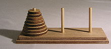

Domanda: è possibile visitare tutte le configurazioni valide del gioco della torre di Hanoi senza mai passare due volte per la stessa configurazione? (Una configurazione è un collocamento degli $n$ dischi sui tre pioli; essa è valida se nessun disco poggia sopra un disco più piccolo.)
In questo problema ti chiediamo di computare il numero di configurazioni valide e di dare risposta alla questione sollevata con un algoritmo che produca una soluzione per ogni possibile valore di $n$.
Se la questione posta ti è chiara, genera il template file per il linguaggio di programmazione di tua scelta: puoi partire direttamente da lì, a parte l'affrontare e risolvere il problema col tuo lavoro, dovresti trovare lì tutte le informazioni necessarie per proporre le tue soluzioni.
Altrimenti prosegui in questa lettura, se la questione posta ti è rimasta un pò misteriosa.
Se non conosci in cosa consista il gioco della torre di Hanoi classico, un'ottima opzione sarebbe quella di affrontare prima questo famoso problema. Puoi trovare la versione classica ed alcune varianti tra i problemi di TuringArena. In ogni caso, forniamo il backgroun necessario ed alcuni links quì sotto. 

In figura trovi un set di gioco della torre di Hanoi.

Da una base orizzontale di legno (tavolo) si ergono $3$ pioli verticali.
All'inizio del gioco, $n$ dischi forati, numerati da $1$ ad $n$ dal più piccolo al più grande, si trovano tutti infilati come ciambelle sul primo paletto, col disco $i$ posto sopra il disco $i+1$, ossia incolonnati in ordine decrescente in modo da formare un cono (la torre di Hanoi). Nella versione classica di questo celebre gioco, lo scopo è portare l'intera torre sul terzo paletto, potendo spostare solo un disco alla volta ed evitando sempre di collocare un disco sopra un disco più piccolo. 

Applet per sperimentare il gioco:
http://www.softschools.com/games/logic_games/tower_of_hanoi/

Gif animata della soluzionne per $n=4$:

E' ben noto che per il puzzle (nella sua versione classica) esiste una soluzione che impiega $2^n-1$ mosse qualsiasi sia il numero $n$ di dischi. Tale soluzione è unica ed ogni altra soluzione impiega un numero di mosse strettamente maggiore.
Ma quante sono le configurazioni valide nel gioco della torre di Hanoi?
Questa è una prima domanda cui in sostanza dovrai rispondere.
Una definizione: una configurazione è valida quando nessun disco poggia sopra un disco più piccolo.
Scoprirai che le configurazioni valide sono molte di più delle $2^n$ configurazioni visitate dalla soluzione ottima del puzzle di Lucas (il matematico che ideò e propose la torre di Hanoi). Tale soluzione visita un sottoinsieme esiguo dello spazio di tutte le configurazioni valide, benchè richieda un numero esponenziale di mosse.
Arriviamo quindi alla nostra domanda:
esisterà una sequenza di mosse che ci consenta di visitare ogni configurazione valida una ed una sola volta?

Alcuni riferimenti sul gioco classico della torre di Hanoi:

https://it.wikipedia.org/wiki/Torre_di_Hanoi