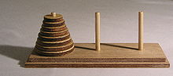

Domanda: è possibile visitare tutte le configurazioni valide entro il gioco della torre di Hanoi (nessun disco poggiato sopra un disco più piccolo) senza mai passare due vole per la stessa configurazione?
In questo problema ti chiediamo di dare risposta algoritmica a questa questione. Se non conosci in cosa consista il gioco della torre di Hanoi, o se la questione posta ti è rimasta un pò misteriosa, prosegui nella lettura. 

In figura trovi un set di gioco della torre di Hanoi.

Da una base orizzontale di legno (tavolo) si ergono $3$ pioli verticali.
All'inizio del gioco, $n$ dischi forati, numerati da $1$ ad $n$ dal più piccolo al più grande, si trovano tutti infilati come ciambelle sul primo paletto, col disco $i$ posto sopra il disco $i+1$, ossia incolonnati in ordine decrescente in modo da formare un cono (la torre di Hanoi). Lo scopo del gioco è portare l'intera torre sul terzo paletto, potendo spostare solo un disco alla volta ed evitando sempre di collocare un disco sopra un disco più piccolo. 

Applet per sperimentare il gioco:
http://www.softschools.com/games/logic_games/tower_of_hanoi/

Gif animata della soluzionne per $n=4$:

E' ben noto che il puzzle è risolvibile qualsiasi sia il valore di $n$, il numero dei dischi. E' inoltre noto che esiste una soluzione che impiega $2^n-1$ mosse, essa è unica ed ogni altra soluzione impiega un numero di mosse maggiore.
Ma quante sono le configurazioni valide nel gioco della torre di Hanoi?
Se per ogni disco scegliamo il piolo in cui collocarlo, ed abbiamo l'accortezza di riporre i dischi ordinati entro ciascun piolo, otteniamo una configurazione valida. Pertanto, le configurazioni valide sono $3^n$. E $3^n >> 2^n -1$, tanto che il raporto tra queste due quantità cresce esponenzialmente.
Possiamo pertanto dire che la soluzione ottima del puzzle di Lucas (il matematico che ideò e propose la torre di Hanoi) visita un sottoinsieme esiguo dello spazio di tutte le configurazioni valide, benchè richieda un numero esponenziale di mosse.
Arriviamo quindi alla nostra domanda:
esisterà una sequenza di $3^n-1$ mosse che ci consenta di visitare ogni configurazione valida una ed una sola volta?

Alcuni riferimenti sul gioco classico della torre di Hanoi:

https://it.wikipedia.org/wiki/Torre_di_Hanoi